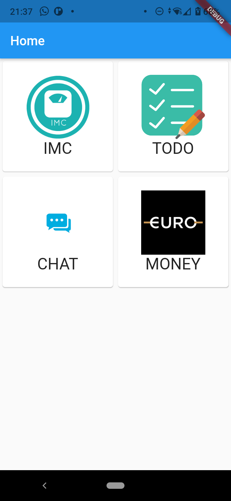
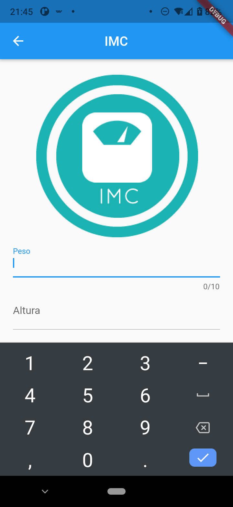
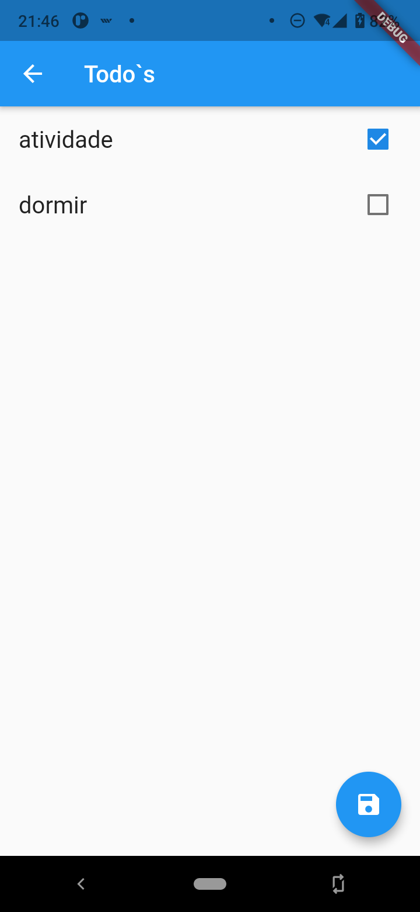
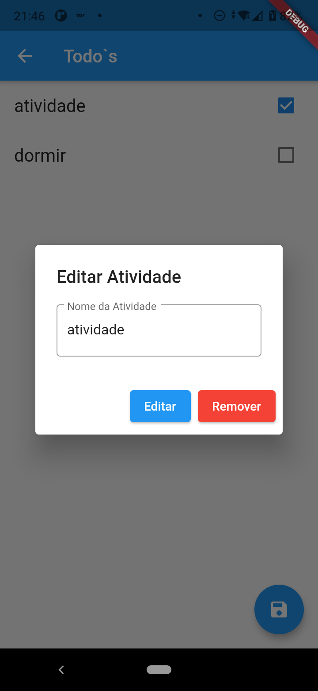

# Atividade Prática

Atividade prática do módulo "Projetos de Soluções Móveis Multiplataforma" do IGTI.

<p align="center">
  
  
  
  
</p>

## Start Project

Para iniciar o projeto é necessário instalar o Flutter e executar o comando:
```
flutter pub get
flutter run
```
Esse projeto funcionará na Web e no Mobile.

Versão do Flutter: 2.0.6\
Versão do Dart: 2.12.3

## Referências
- [Flutter](https://flutter.dev/)
